# Abstract

> With exponentially growing literature amounts, it has become
> increasingly impractical to create a complete literature review. This
> necessitates the need for an automated search for relevant information
> with regard to modern research. The designed system is able to
> generate relevant and related topics from a given seed topic enabling
> the researcher to explore these in more detail. Moreover,
> functionality has been provided to automatically extract relevant
> keywords from the provided abstract. Finally, an internet-based user
> interface is created for easy access and retrieval of information.

## Table of Contents

1.  **Introduction and Overview**

2.  **System Requirement**

    1.  Dataset Description

    2.  Expected Input

    3.  Software and Hardware

    4.  Assumptions and Constraints

3.  **System Workflow**

    1.  Normal Search

    2.  Advanced Search

    3.  Abstract Based Topic Search

4.  **System Design**

    1.  ### Data Preprocessing

        1.  Preprocessing on DB using MongoDB.

        2.  Preprocessing on DB for Abstract based recommendations

        3.  Preprocessing on data for Advanced search using FP-Growth

    2.  **Project snapshots**

5.  **System Implementation**

    1.  **Data extraction using MongoDB**

        1.  Aggregation Framework

        2.  MongoDB queries used for data extraction

    2.  **Algorithm Implementation using Python3**

        1.  PyMongo

        2.  Pickle

        3.  FuzzyWuzzy

        4.  Scikit Learn

        5.  MLxtend
        
        6.  Flask

6.  **Limitations and Future Enhancement**

7.  **Conclusion**

## Introduction and Overview of Project

> Literature review is the systematic study of existing literature to
> properly understand the current research scenario before embarking on
> a research project. For Master\'s students reviewing existing
> literature takes up a exorbitant amount of time. Due to exponentially
> growing amount of literature, it is becoming increasingly infeasible
> to conduct a completely manual literature review.
>
> Several attempts have been made to address the problem of automating
> and systemizing the process of literature review recommendation.
> Several online tools such as SCImago, Scopus, Citenet Explorer, Web of
> Science Database, etc. which analyze citation network to give a
> comprehensive view of the current subject matter. Relatively
> unexplored domain is the area of topic recommendation which involves
> understanding the relevant sister topics to a main topic. This is the
> primary focus of our system.
>
> The designed system can achieve this objective by analyzing the
> co-occurrence of topics in a large database to provide relevant
> recommendation. It can also recommend research topics on a submitted
> research paper abstract.

##  System Requirements
1.  **Dataset Description:**

> The data set is designed for research purposes only. The citation data
> is extracted from DBLP, ACM, MAG (Microsoft Academic Graph), and other
> sources.
>
> In each text file, each line represents a paper, which is in JSON
> schema. The data schema is:

| Field Name       | Field Type      | Description                        | Example                                                                                                        |
|------------------|-----------------|------------------------------------|----------------------------------------------------------------------------------------------------------------|
| id               | string          | paper ID                           | 53e9ab9eb7602d970354a97e                                                                                       |
| title            | string          | paper title                        | Data mining: concepts and techniques                                                                           |
| authors.name     | string          | author name                        | Jiawei Han                                                                                                     |
| author.org       | string          | author affiliation                 | Department of Computer Science, University of Illinois at Urbana-Champaign                                     |
| author.id        | string          | author ID                          | 53f42f36dabfaedce54dcd0c                                                                                       |
| venue.id         | string          | paper venue ID                     | 53e17f5b20f7dfbc07e8ac6e                                                                                       |
| venue.raw        | string          | paper venue name                   | Inteligencia Artificial, Revista Iberoamericana de Inteligencia Artificial                                     |
| year             | int             | published year                     | 2000                                                                                                           |
| keywords         | list of strings | keywords                           | ["data mining", "structured data", "world wide web", "social network", "relational data"]                      |
| fos.name         | string          | paper fields of study              | Web mining                                                                                                     |
| fos.w            | float           | fields of study weight             | 0.659690857                                                                                                    |
| references       | list of strings | paper references                   | ["4909282", "16018031", "16159250",  "19838944", ...]                                                          |
| n_citation       | int             | citation number                    | 40829                                                                                                          |
| page_start       | string          | page start                         | 11                                                                                                             |
| page_end         | string          | page end                           | 18                                                                                                             |
| doc_type         | string          | paper type: journal, book title... | book                                                                                                           |
| lang             | string          | detected language                  | en                                                                                                             |
| publisher        | string          | publisher                          | Elsevier                                                                                                       |
| Volume           | string          | volume                             | 10                                                                                                             |
| issue            | string          | issue                              | 29                                                                                                             |
| issn             | string          | issn                               | 0020-7136                                                                                                      |
| isbn             | string          | isbn                               | 1-55860-489-8                                                                                                  |
| doi              | string          | doi                                | 10.4114/ia.v10i29.873                                                                                          |
| pdf              | string          | pdf URL                            | //static.aminer.org/upload/pdf/1254/ 370/239/53e9ab9eb7602d970354a97e.pdf                                      |
| url              | list            | external links                     | ["http://dx.doi.org/10.4114/ia.v10i29.873", "http://polar.lsi.uned.es/revista/index.php/ia/ article/view/479"] |
| abstract         | string          | abstract                           | Our ability to generate...                                                                                     |
| indexed_abstract | dict            | indexed abstract                   | {"IndexLength": 164, "Inverte                                                                                  |
|                  |                 |                                    | dIndex": {"Our": [0], "ability": [1], "to": [2, 7, ...]}}                                                      |

1.  **Expected Input:**

    -   Research Topic

    -   Research paper abstract

2.  **Software & Hardware:**

    -   Windows 7 Workstation with 16GB of RAM

    -   [DBLP-Citation-network
        V11](https://lfs.aminer.cn/misc/dblp.v11.zip) Dataset from
        Aminer.org

    -   MongoDB

    -   Python

    -   SciKit Learn

    -   MLxtend

    -   Flask

3.  **Assumptions & Constraints:**

    -   The topic search is limited by the topics recorded within the
        particular database.

    -   A subsample of about 1,00,000 papers was taken from the original
        database to apply the keyword prediction from the abstract and
        FP-Growth-based search due to practical time limit constraints.

##  System Workflow

1.  **Normal Search:**
> 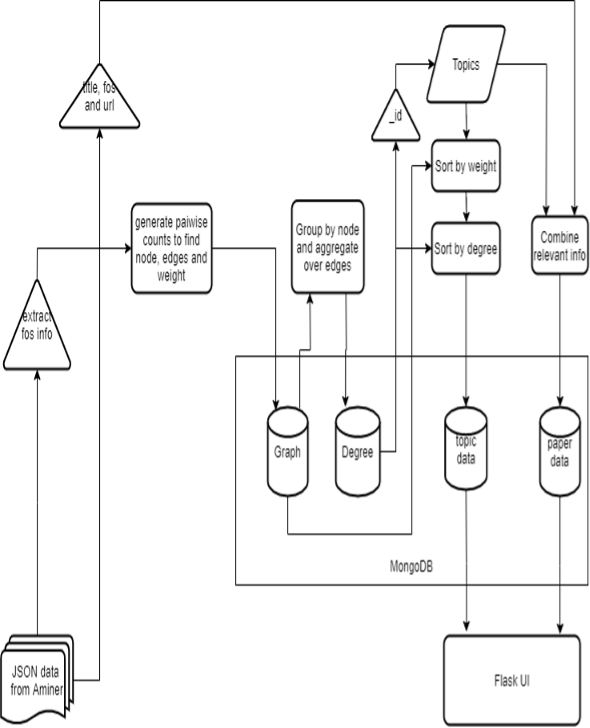

2.  **Advanced Search:**

> 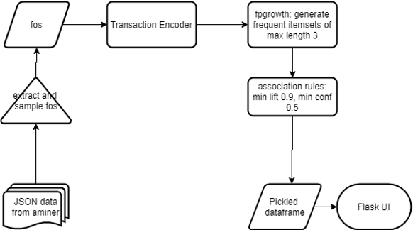

3.  **Abstract Based Topic Search:**
> 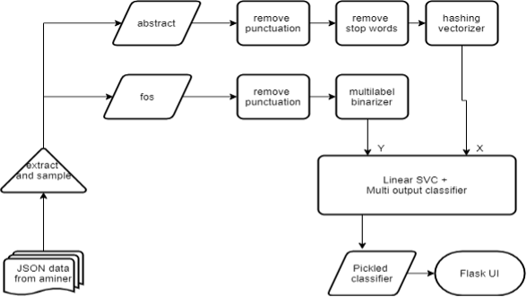

2.  ##  System Design
**Data Preprocessing:**
### Preprocessing on database using MongoDB:

 -   Extracted relevant information primarily the fos, title,
            URL, and citation count.

 -   Performed computations using queries on MongoDB to create a
            collection named graph which consisted of node topic,
            related edge topics and its weight.

-   Performed grouping and summing aggregate operations to
            create degree collection.

-   Sorted topics by weight and ranked by degree for all topics
            to create final collection topic_data used for normal
            search.

-   Created another collection combining topics collection and
            extracted JSON data to create a collection paper_data
            searchable by topics.

### Preprocessing on data for abstract based recommendation:
 
 -   A randomized 100000 sample of indexed_abstract and fos
            (field of study) is selected for keyword prediction based on
            the abstract.

-   A regular expression is applied to the data to obtain each
            abstract as a list and remove all the characters other than
            A-Z or a-z and each word obtained is stored in a single row.

-   Natural language processing NLTK library is used on that
            data to process the abstract.

-   The preprocessing of the abstract data is done with the help
            of regular expression and removing stopping words with the
            help of nltk library.

-   In the fos (field of study) column each field is stored in
            the form of a list and is separated by comma using regular
            expression.

### What are stop words?

-   A stop word is a commonly used word (such as "the", "a",
            "an", "in") that a search engine has been programmed to
            ignore, both when indexing entries for searching and when
            retrieving them as the result of a search query.
-   Following is the code for the removal of stop words from the
            data: import nltk

> from nltk.corpus import stopwords set(stopwords.words('english'))

-   On removing the stopping words from the abstract data will be
    formatted into a bag of important words that can be further used for
    predicting keywords based on the abstract.

-   After removing the stopping words the abstract data is further
    preprocessed to convert it into numerical values using
    sklearn.preprocessing library MultiLabelBinarizer.

-   MultiLabelBinarizer encodes column X into multiple binary columns
    per instance.

-   Here MultiLabelBinarizer is used with the abstract data to convert
    each word in the paragraph of abstract as a column or feature to fit
    the model.

### Preprocessing on data for advance search using FP-Growth:
-   In advance, the search fpgrowth algorithm is used for that the
        original data is sampled into only fos data and further 100000
        random samples are taken from it.

-   To convert the categorical data to transaction encoder is used to
    convert data into Boolean true or false and a sparse dataframe is
    used to store data to keep only the columns of fos that have true
    value.

**Project Snapshots:**
> Fig: Main Layout
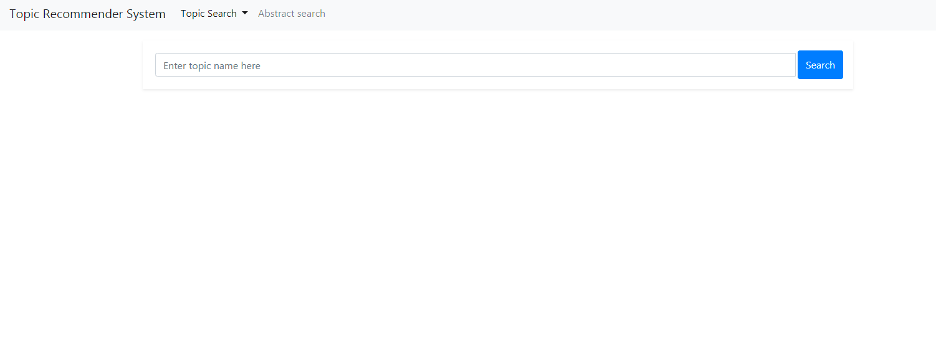

> Fig: Normal Search
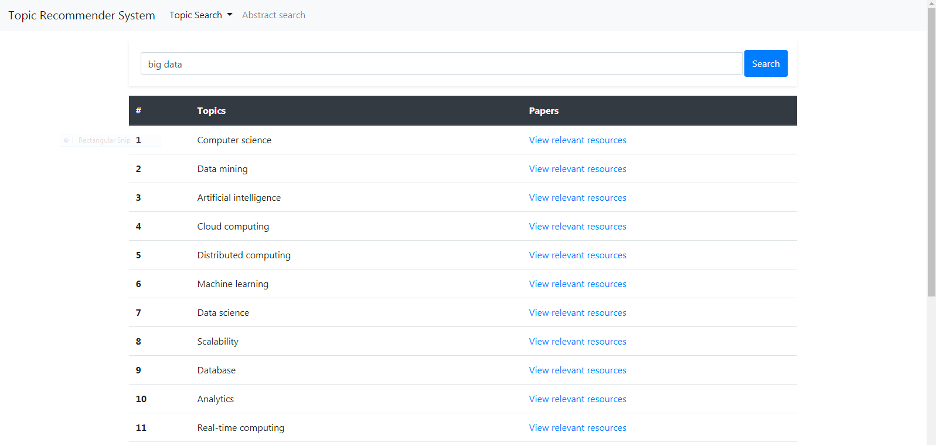

> Fig: Paper Recommendation
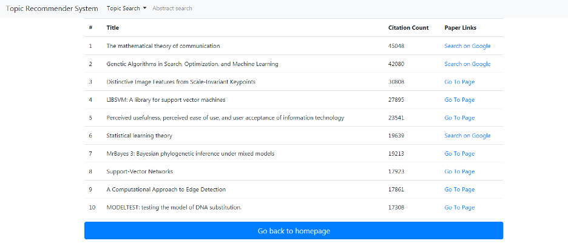

> Fig: Advanced Search
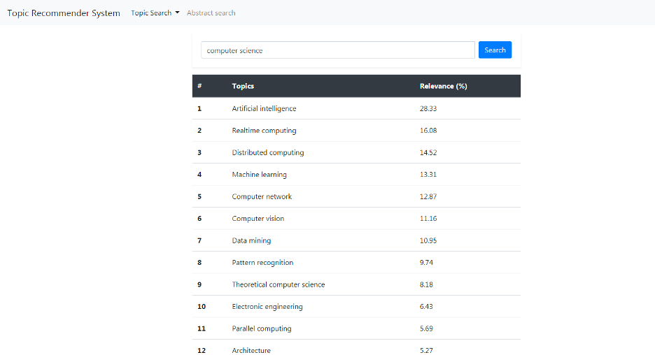

> Fig: Abstract Based Topic Prediction
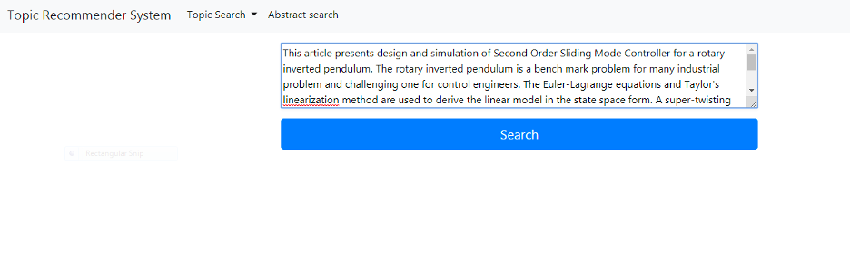

> Fig: Abstract Based Topic Prediction
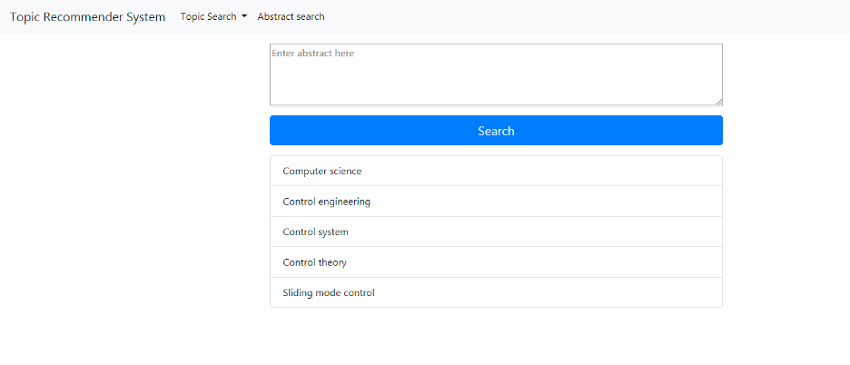

> Fig 4.2.7 Fuzzy-Wuzzy Spelling Correction
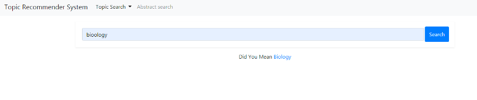

## System Implementation

 ### Data extraction using MongoDB:

### Aggregation:

> Aggregation operations process data records and return computed
> results. Aggregation operations group values from multiple documents
> together, and can perform a variety of operations on the grouped data
> to return a single result. MongoDB provides three ways to perform
> aggregation: the [aggregation
> pipeline](https://docs.mongodb.com/manual/aggregation/#aggregation-framework),
> the [map-reduce
> function,](https://docs.mongodb.com/manual/aggregation/#aggregation-map-reduce)
> and [single purpose aggregation
> methods](https://docs.mongodb.com/manual/aggregation/#single-purpose-agg-operations).
>
> The most basic pipeline stages provide filters that operate like
> queries and document transformations that modify the form of the
> output document. Other pipeline operations provide tools for grouping
> and sorting documents by specific field or fields as well as tools for
> aggregating the contents of arrays, including arrays of documents. In
> addition, pipeline stages can use
> [operators](https://docs.mongodb.com/manual/reference/operator/aggregation/#aggregation-expression-operators)
> for tasks such as calculating the average or concatenating a string.
>
> The pipeline provides efficient data aggregation using native
> operations within MongoDB, and is the preferred method for data
> aggregation in MongoDB. The aggregation pipeline can operate on a
> [sharded](https://docs.mongodb.com/manual/sharding/)
> [collection.](https://docs.mongodb.com/manual/sharding/) The
> aggregation pipeline can use indexes to improve its performance during
> some of its stages. In addition, the aggregation pipeline has an
> internal optimization phase.

### Mongodb queries used for extracting data :

> The image shows the sample of our raw data which we extracted from
> Aminer.org and imported into the MongoDB.
>
> As we can see that there are multiple irrelevant fields in the sample
> data which we have to get rid to continue working with it. Hence to
> remove the unnecessary fields we executed the following query on the
> existing database.

-   ### db.data.aggregate( \[ { \$project : { \"fos.name\" : 1 , id : 1 , \_id : 0} } , { \$addFields : { fos : \'\$fos.name\' } } , { \$out : \"fosdata\" } \] ).pretty()

> So in the above query, we extracted the subfield \"name\" from the
> main field \"fos\" into a new collection named \"fosdata\" using the
> aggregation framework of mongodb, fos represents a field of study here
> which is the only required data as of now.
>
> So as the resultant of the above query we have all the names of fields
> of studies existing in the database into a single collection i.e.
> \"fosdata\".
>
> 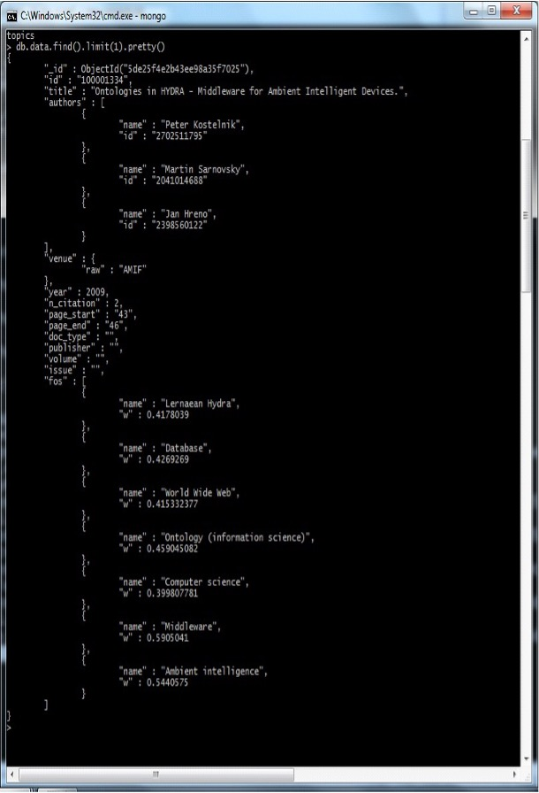
> 
> 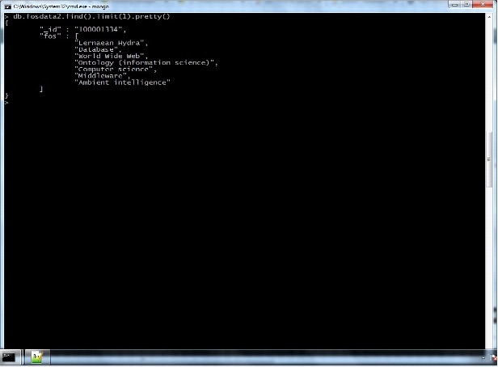

> We can see in the above image a sample of fosdata which we extracted
> from the last operation on the database. Now for further processing,
> we required the total number of occurances of a pair of fields, which
> means that if a specific field of study is cited in another field of
> study then the count should be increased by one.
>
> So for achieving this we executed the following query on the data.

-   db.fosdata2.aggregate(\[{

> \$unwind : \"\$fos\"
>
> }, {
>
> \$lookup : {
>
> from : \"fosdata2\", localField : \"\_id\", foreignField : \"\_id\",
> as : \"items\"

}

}, {

> \$unwind : \"\$items\"
>
> }, {
>
> \$unwind : \"\$items.fos\"
>
> }, {
>
> \$redact : {
>
> \$cond : { if : {
>
> {width="2.5329582239720034in"
> height="0.5531244531933508in"}
>
> \$cmp : \[\"\$fos\", \"\$items.fos\"\]
>
> },

}

}

}, {

> then : \"\$\$DESCEND\", else : \"\$\$PRUNE\"
>
> \$group : {
>
> \_id : {
>
> k1 : \"\$fos\",
>
> k2 : \"\$items.fos\",
>
> },
>
> items : {
>
> \$sum : 0.5
>
> }

}

}, {

> \$sort : {
>
> \"\_id\" : 1

}

}, {

> \$project : {
>
> \_id : 1,
>
> items : 1, a : {
>
> \$cond : { if : {
>
> \$eq : \[{
>
> \$cmp : \[\"\$\_id.k1\", \"\$\_id.k2\"\]
>
> }, 1\]
>
> },
>
> then : \"\$\_id.k2\", else : \"\$\_id.k1\"
>
> }
>
> },
>
> b : {
>
> \$cond : { if : {
>
> \$eq : \[{
>
> \$cmp : \[\"\$\_id.k1\", \"\$\_id.k2\"\]
>
> }, -1\]
>
> },
>
> then : \"\$\_id.k2\", else : \"\$\_id.k1\"
>
> }
>
> },
>
> }
>
> }, {
>
> {width="2.5329582239720034in"
> height="0.5531244531933508in"}
>
> \$group : {
>
> \_id : {
>
> k1 : \"\$a\",
>
> k2 : \"\$b\",
>
> },
>
> items : {
>
> \$sum : \"\$items\"
>
> }

}

}, {

> \$project : {
>
> \_id : 0,
>
> node : \"\$\_id.k1\",
>
> arc : \"\$\_id.k2\", weight : \"\$items\"
>
> }
>
> } , { \$out : \"graph\" }
>
> \] , {allowDiskUse : true})
>
> The output of following query is shown in the following image. The
> node and arc fields are the names of fields of study.

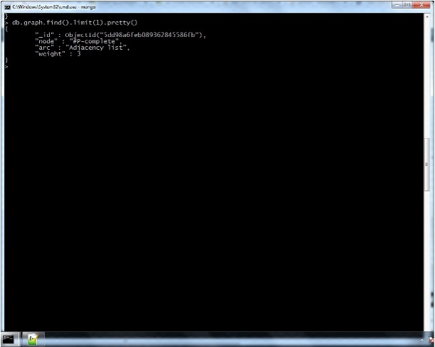

>
> The weight field in the above sample signifies only the number of
> occurrences of the fields but to understand the clustering properly we
> require an additional measure of the degree of a field to decide the
> main fields from the set of fields. The logic follows here that a
> field with a higher degree is the main field among the closely related
> fields this calculation considers the weight as well as the degree of
> a field to decide the subfields and main fields. As a result, we will
> get a cluster of fields of study.

-   db.graph.aggregate(\[{\$group:{\_id:\"\$node\",degree:{\$sum:
    1}}},{\$out:\"degree\"}\]).pretty()

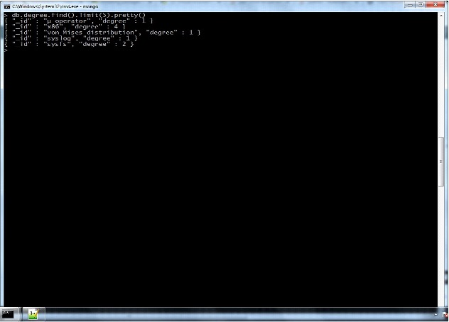

-   db.data.aggregate(\[{\$match:{\$and:\[{\'indexed_abstract.InvertedIndex\':{\$ne:null}},{fos:{\$ne:null}},

> {n_citation:{\$ne:null}},{doi:{\$ne:null}}\]}},{\$sample:{size:100000}},{\$project:{\'\_id\':\'\$id\',
>
> \'title\':1,
>
> \'authors\':1,
>
> \'venue.raw\':1,
>
> \'year\':1, \'n_citation\':1,
>
> \'indexed_abstract.InvertedIndex\':1,
>
> \'fos\': 1, \'doi\':1,}},
>
> {\$out:\"final_data\"}\],{allowDiskUse: true})

Randomly selects 1,00,000 samples from the whole data. This selective
sample is required for the relevant topic recommendation based on the
given abstract using text mining.

> {width="2.5329582239720034in"
> height="0.5531244531933508in"}

## Algorithm Implementation Using Python3

### PyMongo:

> The PyMongo distribution contains tools for interacting with MongoDB
> database from Python.
>
> The bson package is an implementation of the [BSON
> format](http://bsonspec.org/) for Python.
>
> The PyMongo package is a native Python driver for MongoDB. The gridfs
> package is a
> [gridfs](http://www.mongodb.org/display/DOCS/GridFS%2BSpecification)
> implementation on top of PyMongo.
>
> As mentioned above we also used PyMongo for interaction with our
> database to extract data from database and perform python scripting on
> it for functioning and calculations.

### Pickle:

> **Pickle --- Python object serialization :**
>
> The pickle module implements a fundamental, but powerful algorithm for
> serializing and de- serializing a Python object structure. "Pickling"
> is the process whereby a Python object hierarchy is converted into a
> byte stream, and "unpickling" is the inverse operation, whereby a byte
> stream is converted back into an object hierarchy. Pickling (and
> unpickling) is alternatively known as "serialization", "marshalling,"
> or "flattening".

### Fuzzy-Wuzzy:

> There are many methods of comparing string in python. Some of the main
> methods are:

1.  **Using regex**

2.  **Simple compare**

3.  **Using difflib**

> But one of the very easy method is by using fuzzy-wuzzy library where
> we can have a score out of 100, that denotes two string are equal by
> giving similarity index.
>
> We used this library of Python which is used for string matching.
> Fuzzy string matching is the process of finding strings that match a
> given pattern. Basically, it uses Levenshtein Distance to calculate
> the differences between sequences.

### SciKit Learn:

> Scikit-learn provides a range of supervised and unsupervised learning
> algorithms via a consistent interface in Python.
>
> The library is focused on modeling data. It is not focused on loading,
> manipulating, and summarizing data. For these features, refer to NumPy
> and Pandas. We use SciKit-learn for data preprocessing.
>

### Hashing Vectorizer:

> It turns a collection of text documents into a scipy.sparse matrix
> holding token occurrence counts (or binary occurrence information),
> possibly normalized as token frequencies if norm='l1' or projected on
> the Euclidean unit sphere if norm='l2'.
>
> This text vectorizer implementation uses the hashing trick to find the
> token string name to feature integer index mapping.

-   ### This strategy has several advantages:

1.  It is very low memory scalable to large datasets as there is no need
    to store a vocabulary dictionary in memory

2.  It is fast to pickle and un-pickle as it holds no state besides the
    constructor parameters

3.  It can be used in a streaming (partial fit) or parallel pipeline as
    there is no state computed during fit.

### Multi-Label Binarizer:

> Binarize labels in a one-vs-all fashion. Several regression and binary
> classification algorithms are available in scikit-learn. A simple way
> to extend these algorithms to the multi-class classification case is
> to use the so-called one-vs-all scheme.
>
> At learning time, this simply consists in learning one regressor or
> binary classifier per class. In doing so, one needs to convert
> multi-class labels to binary labels (belong or does not belong to the
> class). Label Binarizer makes this process easy with the transform
> method.
>
> One assigns the class for which the corresponding model gave the
> greatest confidence at prediction time. Label Binarizer makes this
> easy with the inverse transform method.

### Multi Output Classifier:

> This strategy consists of fitting one classifier per target. This is a
> simple strategy for extending classifiers that do not natively support
> multi-target classification.

### Linear SVC:

> Linear Support Vector Classification. Similar to SVC with parameter
> kernel='linear', but implemented in terms of liblinear rather than
> libsvm, so it has more flexibility in the choice of penalties and loss
> functions and should scale better to large numbers of samples.
>
> This class supports both dense and sparse input and the multiclass
> support is handled according to a one-vs-the-rest scheme.
>
> {width="2.5329582239720034in"
> height="0.5531244531933508in"}

### MLxtend:

### FP Growth:

> FP-Growth is an algorithm for extracting frequent itemsets with
> applications in association rule learning that emerged as a popular
> alternative to the established Apriori algorithm.
>
> In general, the algorithm has been designed to operate on databases
> containing transactions, such as purchases by customers of a store. An
> item set is considered as \"frequent\" if it meets a user-specified
> support threshold. For instance, if the support threshold is set to
> 0.5 (50%), a frequent itemset is defined as a set of items that occur
> together in at least 50% of all transactions in the database.
>
> In particular, and what makes it different from the Apriori frequent
> pattern mining algorithm, FP- Growth is a frequent pattern mining
> algorithm that does not require candidate generation. Internally, it
> uses a so-called FP-tree (frequent pattern tree) data structure
> without generating the candidate sets explicitly, which makes is
> particularly attractive for large datasets.

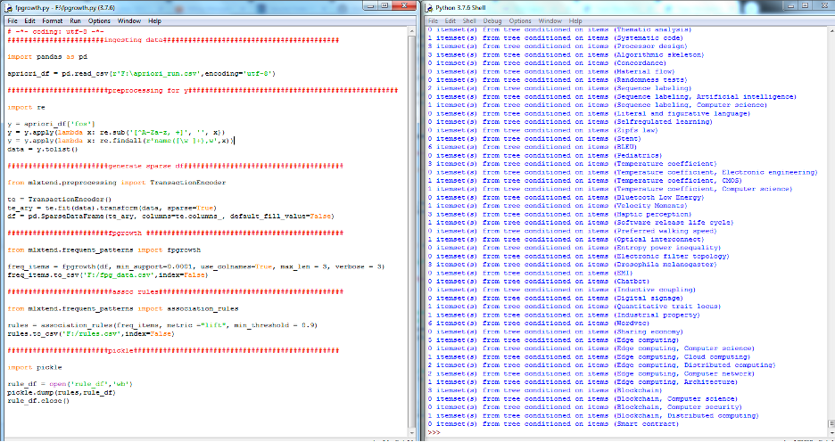

### NLP:

> [NLP is used to analyze
> text](https://blog.algorithmia.com/2015/09/getting-started-with-natural-language-processing/),
> allowing machines to [understand how humans
> speak](https://en.wikipedia.org/wiki/Artificial_intelligence#Natural_language_processing_.28communication.29).
> This human-computer interaction enables real-world applications like
> [automatic text
> summarization](https://en.wikipedia.org/wiki/Automatic_summarization),
> [sentiment](https://en.wikipedia.org/wiki/Sentiment_analysis)
> [analysis](https://en.wikipedia.org/wiki/Sentiment_analysis), [topic
> extraction,](https://en.wikipedia.org/wiki/Terminology_extraction)
> [named entity
> recognition](https://en.wikipedia.org/wiki/Named-entity_recognition),
> [parts-of-speech
> tagging,](https://en.wikipedia.org/wiki/Part-of-speech_tagging)
> [relationship](https://en.wikipedia.org/wiki/Relationship_extraction)
> [extraction,](https://en.wikipedia.org/wiki/Relationship_extraction)
> [stemming,](https://en.wikipedia.org/wiki/Stemming) and more. NLP is
> commonly used for [text
> mining,](https://en.wikipedia.org/wiki/Text_mining) [machine
> translation,](https://en.wikipedia.org/wiki/Machine_translation) and
> [automated](https://en.wikipedia.org/wiki/Question_answering)
> [question
> answering.](https://en.wikipedia.org/wiki/Question_answering)
>

### NLTK:

> [Natural Language Toolkit (NLTK)](http://www.nltk.org/): a Python
> library that provides modules for processing text, classifying,
> tokenizing, stemming, tagging, parsing, and more.
>
> Natural Language Processing with Python Natural language processing
> (NLP) is a research field that presents many challenges such as
> natural language understanding.
>
> Text may contain stop words like 'the', 'is', 'are'. Stop words can be
> filtered from the text to be processed. There is no universal list of
> stop words in NLP research, however, the nltk module contains a list
> of stop words.

### Flask:

> Flask is a lightweight [WSGI](https://wsgi.readthedocs.io/) (Web
> Server Gateway Interface) web application framework. It is designed to
> make getting started quick and easy, with the ability to scale up to
> complex applications. It began as a simple wrapper around
> [\'Werkzeug\'](https://www.palletsprojects.com/p/werkzeug)
> (comprehensive [WSGI](https://wsgi.readthedocs.io/en/latest/) web
> application library) and
> [\'Jinja\'](https://www.palletsprojects.com/p/jinja) and has become
> one of the most popular Python web application frameworks.
>
> Flask offers suggestions but doesn\'t enforce any dependencies or
> project layout. It is up to the developer to choose the tools and
> libraries they want to use. There are many extensions provided by the
> community that make adding new functionality easy.

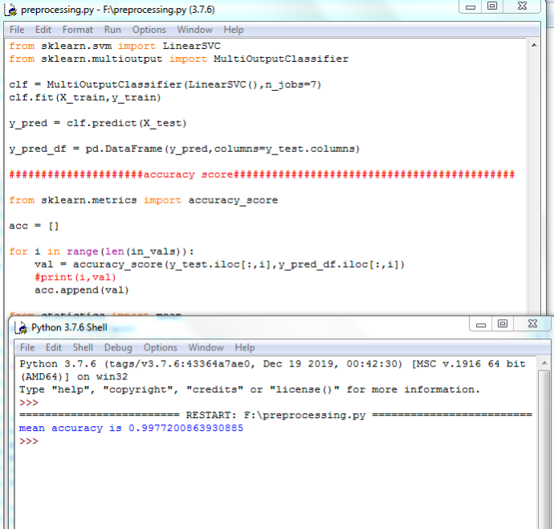

### Jinja Syntax in Flask:

> Jinja is one of the most used template engines for Python. It is
> inspired by Django\'s templating system but extends it with an
> expressive language that gives template authors a more powerful set of
> tools. On top of that, it adds sandboxed execution and optional
> automatic escaping for applications where security is important.
>
> It is internally based on Unicode and runs on a wide range of Python
> versions.

### Method \'app.route\' in Flask :

> Modern web frameworks use the routing technique to help a user
> remember application URLs. It is useful to access the desired page
> directly without having to navigate from the home page.
>
> The route() decorator in Flask is used to bind the URL to a function.
> For example,

>  @app.route(‘/hello’)   
>    def hello_world():  
>    return ‘hello world'

> Here, the URL '/hello' rule is bound to the hello_world() function. As
> a result, if a user visits http://localhost:5000/hello URL, the output
> of the hello_world() function will be rendered in the browser.

### Request Handling in Flask using Request Object:

> The client's web page data is sent to the server as a global request
> object. In order to process the request data, it should be imported
> from the Flask module.

### Important attributes of the request object are listed below:

-   **Form −** It is a dictionary object containing key and value pairs
    of form parameters and their values.

-   **args −** parsed contents of query string which is part of URL
    after question mark (?).

-   **files −** data pertaining to uploaded file.

-   **method −** current request method.

### Template Rendering in Flask:

> It is possible to return the output of a function bound to a certain
> URL in the form of HTML. For instance, in the following script,
> hello() function will render 'Hello World' with \<h1\> tag attached to
> it.
>
> from flask import Flask 
> app = Flask(__name__) 
> @app.route('/') 
> def index():
> return '\<html>\<body>\<h1>Hello World\</h1>\</body>\</html>' 
> if __name__ == '__main__': 
> app.run(debug = True)
>
> However, generating HTML content from Python code is cumbersome,
> especially when variable data and Python language elements like
> conditionals or loops need to be put. This would require frequent
> escaping from HTML.
>
> This is where one can take advantage of Jinja2 template engine, on
> which Flask is based. Instead of returning hardcode HTML from the
> function, a HTML file can be rendered by the render_template()
> function.
>
>from flask import Flask  
>app = Flask(__name__ )  
>@app.route('/')  
>def index():  
>return render_template(‘hello.html’)  
>if __name__ == '__main__':  
>app.run(debug = True)  

> Flask will try to find the HTML file in the templates folder, in the
> same folder in which this script is present.

-   Application folder

    -   Hello.py

    -   templates

        -   hello.html

> The term 'web templating system' refers to designing an HTML script in
> which the variable data can be inserted dynamically. A web template
> system comprises of a template engine, some kind of data source and a
> template processor.

## Limitation and Future Enhancement

1.  For now, topics are being recommended based on the present limited
    dataset only.

2.  Due to resource constraints the data samples used to topic
    prediction based on abstract and advance search are randomized
    100000 samples.

3.  Full dataset can be utilized for better algorithm accuracy and
    prediction and can be deployed on a scalable system.

4.  Real time data for research topic recommendation can be taken using
    web scrapping related website.

5.  Advanced algorithm can be used for recommending most related topics
    such as page rank algorithm.

## Conclusion

> Thus, we can say that the designed system fulfills the objective of
> research topic recommendation by involving multiple strategies like
> node degree and edge weight or the FP-Growth algorithm. Another tool
> provided to recommend topics based on abstract data is also included
> which has good accuracy. Although there are multiple avenues for
> improvement such as increasing data size, query coverage, more
> structured web app, etc. we believe that this system will be able to
> provide good value for its users.

## Links and References
-   [[https://www.aminer.cn/citation]{.underline}](https://www.aminer.cn/citation)

-   [[https://clarivate.com/webofsciencegroup/solutions/web-of-science/]{.underline}](https://clarivate.com/webofsciencegroup/solutions/web-of-science/)

-   [[https://www.citnetexplorer.nl/]{.underline}](https://www.citnetexplorer.nl/)

-   [[https://www.microsoft.com/en-us/research/project/microsoft-academic-graph/]{.underline}](https://www.microsoft.com/en-us/research/project/microsoft-academic-graph/)

-   [[https://en.wikipedia.org/wiki/Centrality]{.underline}](https://en.wikipedia.org/wiki/Centrality)

-   [[https://en.wikipedia.org/wiki/Association_rule_learning#FP-growth_algorithm]{.underline}](https://en.wikipedia.org/wiki/Association_rule_learning#FP-growth_algorithm)

-   [[https://scikit-learn.org/stable/]{.underline}](https://scikit-learn.org/stable/)

-   [[http://rasbt.github.io/mlxtend/]{.underline}](http://rasbt.github.io/mlxtend/)

-   [[https://www.palletsprojects.com/p/flask/]{.underline}](https://www.palletsprojects.com/p/flask/)
